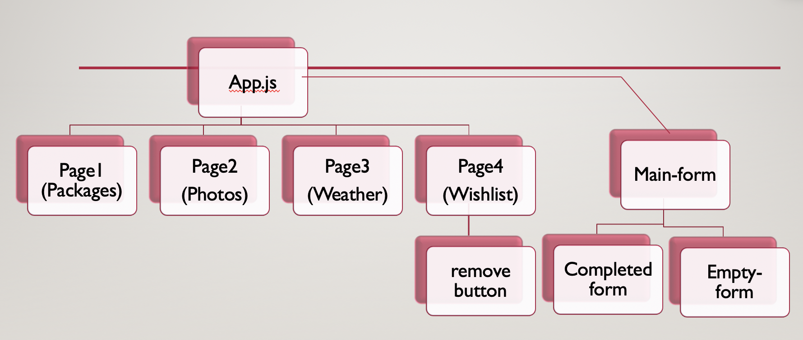

**Travel App** :earth_africa:

Holidays are hard. We make them easy. This app can use as a travel plan.

###Description

This App is an app for travel plan when user plan fpor their trips and with soem of the functions

- Able to check avaialble travel packages for 2022
- Able to search for photos and Weather
- Able to save your plan to manage the trip

###Technical Used :hammer_and_wrench:

- React
- useState
- UseEffect
- 10 props
- 4 lifting state
- 10 states
- 10 setState
- 4 routes

User Stories

A story of the project user, that explains the use of the project.
##Screenshots

###Planning and Development Process

A basic story of your planning and developing this project.
The plan is to build for a app to fetch data for hotel, flight , attraction, but couldn't get the free API.

Problem-Solving Strategy
I believe logic thinking is important and understand the project structure, initially i was wrong place the state in one of the child component and end up the information did not manage to pass over to the another componenent. Must plan and draw out in order for you to set the correct state in the correct place. example: planning the hierarchy who will the parents component and who will be the child.

try in error is the strategy I learn from .

I believe is the way of achieving an aim or solving a problem by trying a number of different methods and learning from the mistakes that I make.

###Unsolved problems

1 thing is not solve it yet, that is the weather input not able to fetch data if I liftiung up the state to the parent component. 1st i thought is the setName issue , but after I change it if still doesn't work when the user key in the country name, i have return all back to the child component and will work on it again.

###APIs Used

1.https://source.unsplash.com/400x200/? 2.https://api.openweathermap.org/data/2.5/weather?q=${props.input}&units=metric&appid=86a33b3bc07850d9a2d013d789d09795

Acknowledgments

References
